# JWT in spring boot

This projects presents a simple usage of JWT authentication and authorization using JWT and auth0.

## Identity provider

Auth0 is an aidentity provider that allow us to manage users, authentication, authorization, token management and requesting, and a lot more.

First we need to create an auth0 tenant. Go to [Auth0 register](https://manage.auth0.com/) and create a tenant.

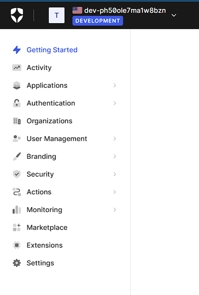

Now we can create an API to handle our users.

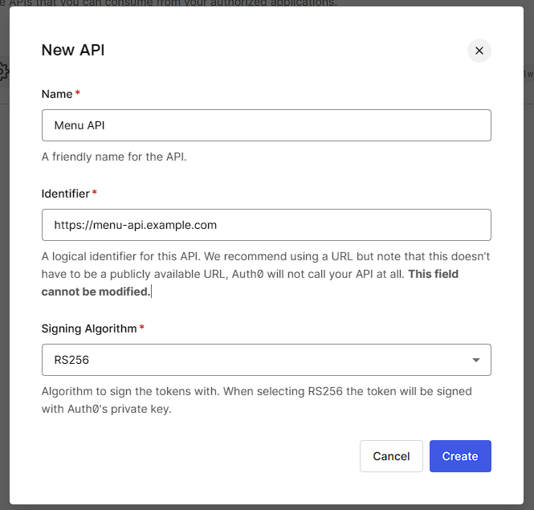


## Properties configuration

In order to allow our application to communicate to Auth0 and requests tokens, we must specify an endpoint for token management and a audience value that lets Auth0 in which API we are going to request access for the user.

```properties
server.port=7000
auth0.audience=https://menu-api.example.com
auth0.domain=dev-ph50ole7ma1w8bzn.us.auth0.com/oauth/token
spring.security.oauth2.resourceserver.jwt.issuer-uri=https://${auth0.domain}/
```

## Protecting out application endpoint from unauthorized access

First we need to enable spring security to request JWT tokens and validate these against the auth0 endpoint.

```java
    @Override
    protected void configure(HttpSecurity http) throws Exception {
        http.authorizeRequests()
                .mvcMatchers(HttpMethod.GET, "/api/menu/items/**").permitAll() // GET requests don't need auth
                .anyRequest()
                .authenticated()
                .and()
                .oauth2ResourceServer()
                .jwt();
    }
```

We also can validate the audience value to a set of trustes audiences.

```java
    public OAuth2TokenValidatorResult validate(Jwt jwt) {
        List<String> audiences = jwt.getAudience();
        System.out.println(audiences);
        if (audiences.contains(this.audience)) {
            return OAuth2TokenValidatorResult.success();
        }
        OAuth2Error err = new OAuth2Error(OAuth2ErrorCodes.INVALID_TOKEN);
        return OAuth2TokenValidatorResult.failure(err);
    }
```


At this point we must validate the token with the issuer and the exact audience parameter.

```java
    protected JwtDecoder jwtDecoder() {
        OAuth2TokenValidator<Jwt> withAudience = new AudienceValidator(audience);
        OAuth2TokenValidator<Jwt> withIssuer = JwtValidators.createDefaultWithIssuer(issuer);
        OAuth2TokenValidator<Jwt> validator = new DelegatingOAuth2TokenValidator<>(withAudience, withIssuer);

        NimbusJwtDecoder jwtDecoder = (NimbusJwtDecoder) JwtDecoders.fromOidcIssuerLocation(issuer);
        jwtDecoder.setJwtValidator(validator);
        return jwtDecoder;
    }
```


## Client application creation

We need to create an application that is going to be able to request tokens with claims that are associated to this [app](https://manage.auth0.com/#/applications).

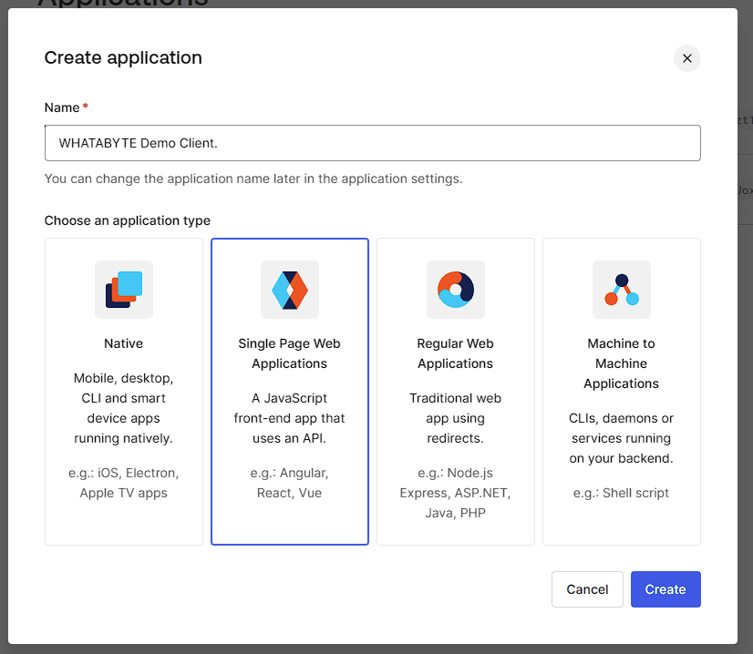

Now that we created the application in auth0, we can create an user and test in the integration is correct.

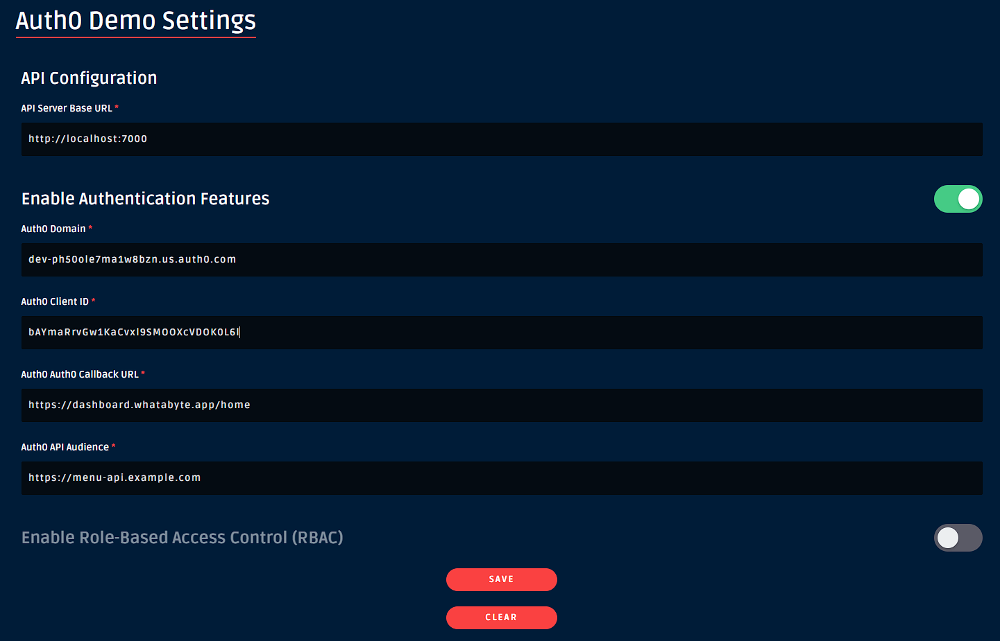

Now lets test the sign in.

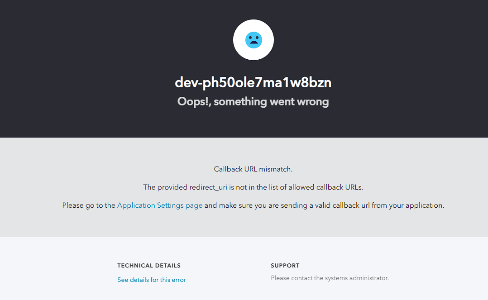

Oops, it did not work. Looks like Auth0 is blocking the callback URL that our website sends in order to complete the process.

```
redirect_uri=https%3A%2F%2Fdashboard.whatabyte.app%2Fhome&scope=openid%20profile%20email&response_type=code&response_mode=query&state=Z2IwVzVvbjlyWGJ0MGNqbjV2UWdvSm1pflMzSGFPei1YRlRnNUE5WmpsVQ%3D%3D&nonce=ZmRVNjVsUkEyZ1d1cGZrRDRIdVFNSjR6NGFUSHhDa1EzUkg0WXJSS2dSMA%3D%3D&code_challenge=HYvCNV7_-chDo1ze96DVekOJ_UePrWpY7Y93J3IN0-0&code_challenge_method=S256&auth0Client=eyJuYW1lIjoiYXV0aDAtcmVhY3QiLCJ2ZXJzaW9uIjoiMS4yLjAifQ%3D%3D
```

We must enable it in the Auth0 application. Lets enable this endpoint for callback, cors, and logout.

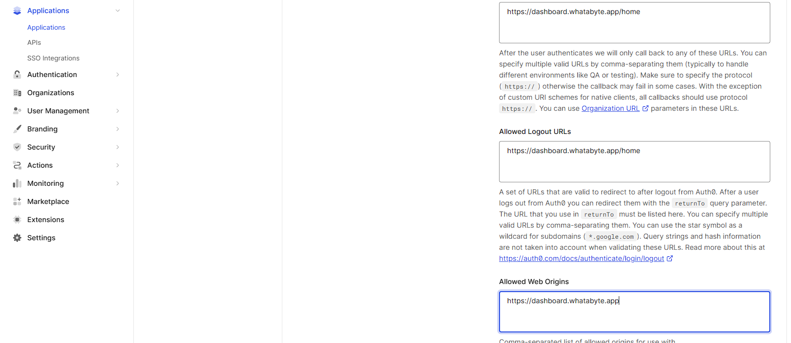

## Configure cors spring boot

To allow the front end application to send request to spring boot, me must allow cors first.

```java
    protected CorsConfigurationSource corsConfigurationSource() {
        CorsConfiguration configuration = new CorsConfiguration();
        configuration.setAllowedMethods(List.of(
                HttpMethod.GET.name(),
                HttpMethod.PUT.name(),
                HttpMethod.POST.name(),
                HttpMethod.DELETE.name()
        ));

        UrlBasedCorsConfigurationSource source = new UrlBasedCorsConfigurationSource();
        source.registerCorsConfiguration("/**", configuration.applyPermitDefaultValues());
        return source;
    }
```

## Login test

Lest test the login in the application :)


Now we have a user.

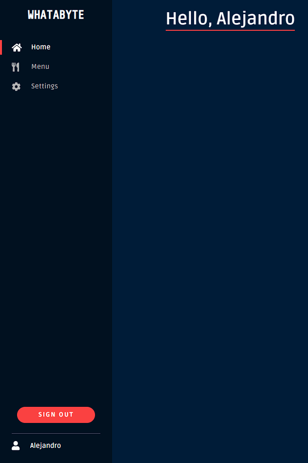


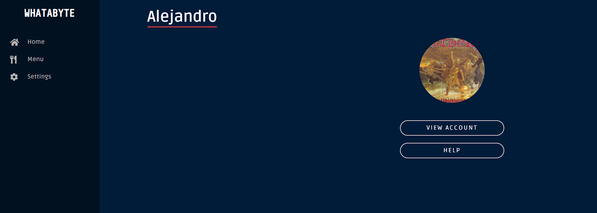

Now we can check if the authentication is working in deed. If we disable auth, we can no longer add nor delete items from the menu.

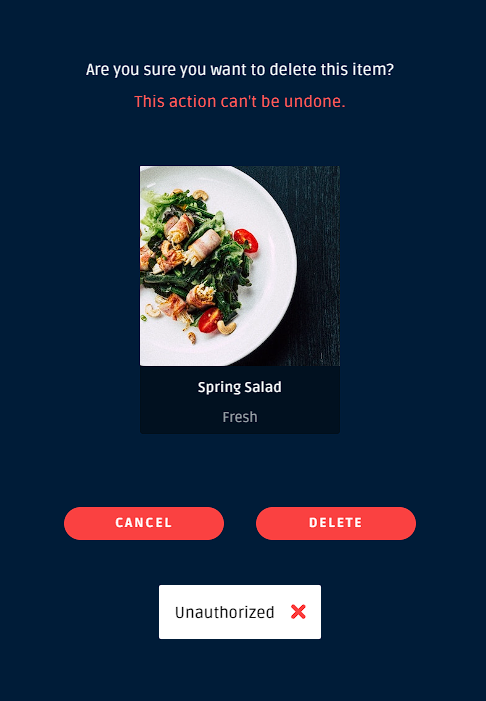


## Authorization - Playing with roles

We can allow authorization in OICD using the JWT claims. Lets start with the admin role.

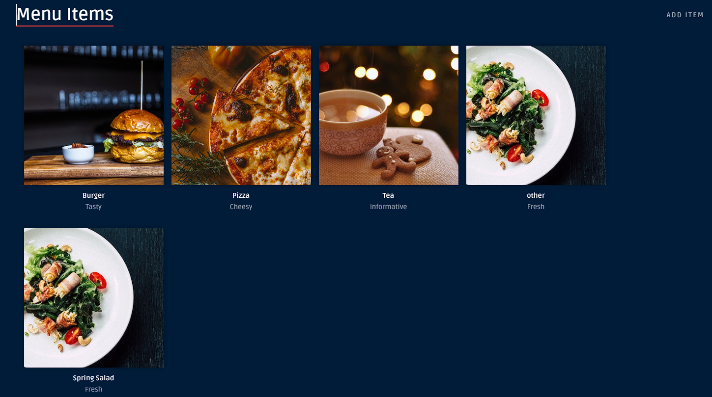

Currently we are able to create menu from the add item button. We must configure the application to validate the roles and only allow admin users to do so.

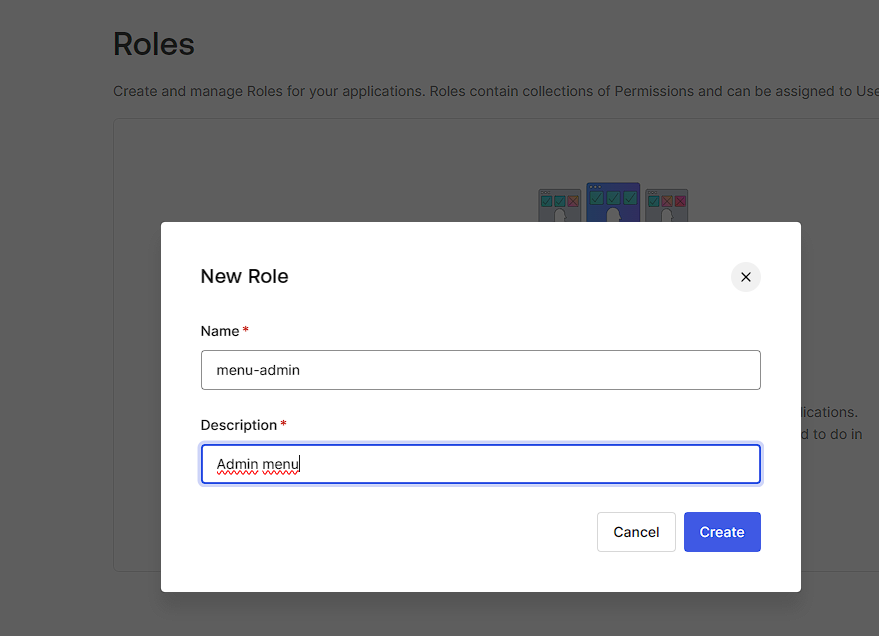

Lets create a set of permissions.

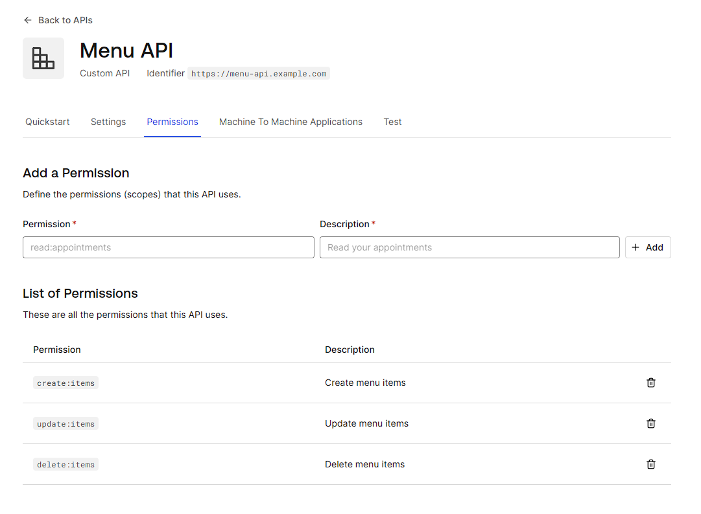

Also enable RBAC for this API.

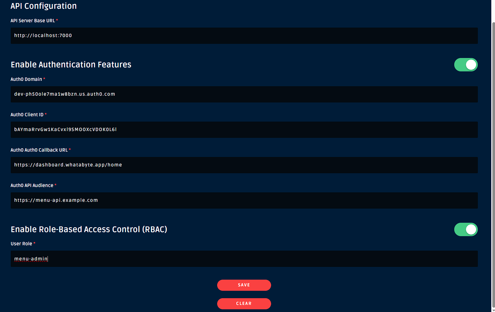


Add the API permissions to the admin role.

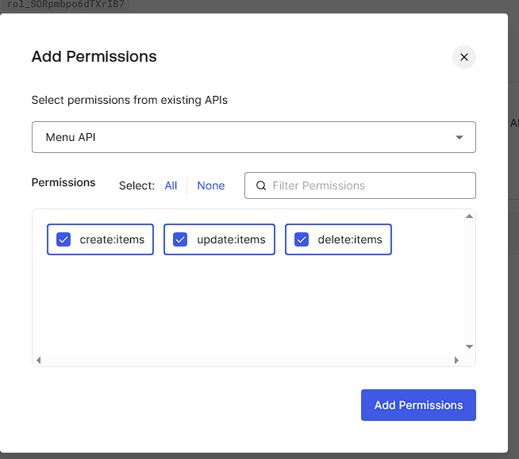


## Add roles to tokens

If we want to add additional claims to the tokens, we must create an action to add these. Go to auth0 [actions](https://manage.auth0.com/#/actions/library)

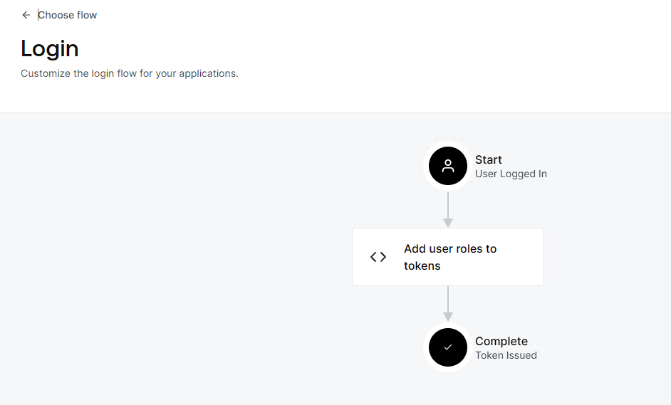

We are going to add this action to add the roles claim for every token.

```javascript
exports.onExecutePostLogin = async (event, api) => {
  const namespace = 'https://menu-api.example.com';
  if (event.authorization) {
    const assignedRoles = event.authorization.roles;

    if (api.idToken) {
      api.idToken.setCustomClaim(`${namespace}/roles`, assignedRoles)
    }

    if (api.accessToken) {
      api.accessToken.setCustomClaim(`${namespace}/roles`, assignedRoles)
    }

   
  }
};
```


## Testing RBAC

Lets enable RBAC in the page


We see the add button is no longer available


Now lets create an admin user and assign him the admin role.

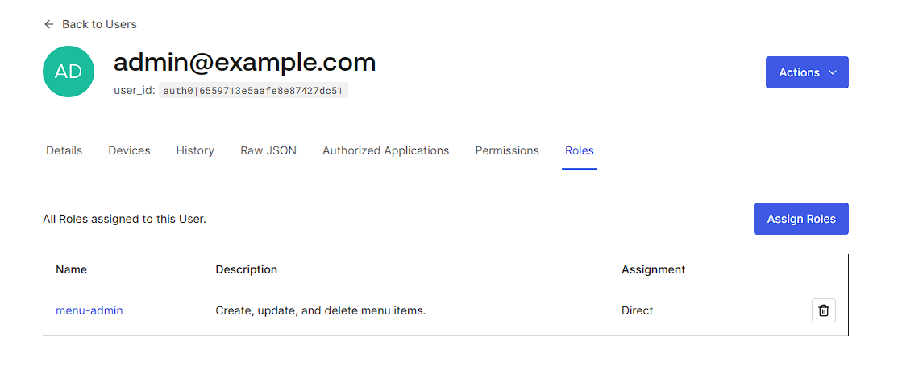

If we login with this new user we can see the role in the claim, and in the page, we can now add items.

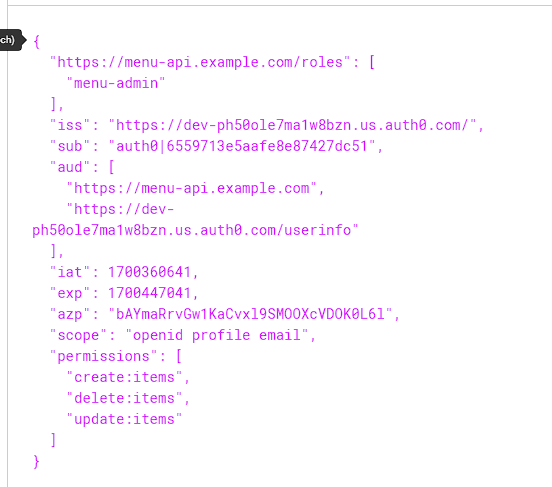


## Authorization in spring boot

Now we can use the claims to read these in spring boot.

```java
    JwtAuthenticationConverter jwtAuthenticationConverter() {
        JwtGrantedAuthoritiesConverter converter = new JwtGrantedAuthoritiesConverter();
        converter.setAuthoritiesClaimName("permissions");
        converter.setAuthorityPrefix("");

        JwtAuthenticationConverter jwtConverter = new JwtAuthenticationConverter();
        jwtConverter.setJwtGrantedAuthoritiesConverter(converter);
        return jwtConverter;
    }
```

Add this converter to allow spring to read the authorities from the permissions claim.

```java
.jwtAuthenticationConverter(jwtAuthenticationConverter());
```

Lets add the authorization for the endpoints.

```java
@PreAuthorize("hasAuthority('update:items')")
```

Now our endpoints are protected, as well as our front.

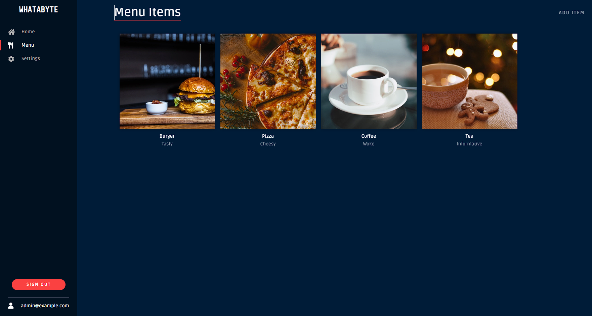

If we try to add items as non admin user, we obtain 403 :).

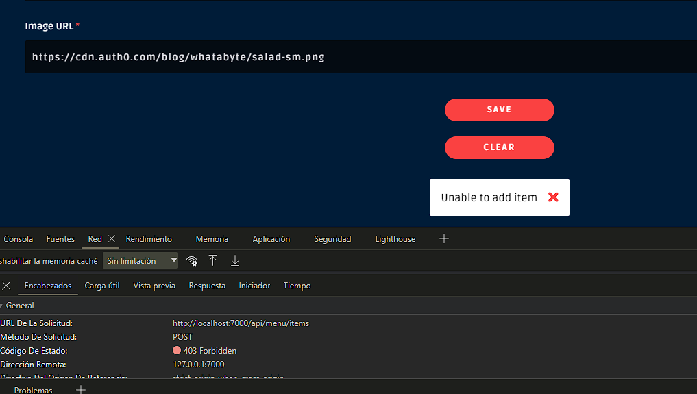